  

 

<pre>
╔══════════════════════════════════════════════════════╗
║                                                      ║
║   ██████╗ ██████╗ ██████╗ ███████╗                  ║
║  ██╔════╝██╔═══██╗██╔══██╗██╔════╝                  ║
║  ██║     ██║   ██║██║  ██║█████╗                    ║
║  ██║     ██║   ██║██║  ██║██╔══╝                    ║
║  ╚██████╗╚██████╔╝██████╔╝███████╗                  ║
║   ╚═════╝ ╚═════╝ ╚═════╝ ╚══════╝                  ║
║                                                      ║
║      C R A F T E R  ·  A D I                        ║
║                                                      ║
║  ─────────────────────────────────────────────────   ║
║                                                      ║
║  AI ENGINEER  ·  BUILDER  ·  SYSTEMS THINKER         ║
║                                                      ║
╚══════════════════════════════════════════════════════╝
</pre>

  

 

---

### ◈ ABOUT THE ENGINEER

> **I build AI systems, scalable backends, and autonomous agent workflows.**  
> Focused on real-world software engineering, clean system architecture, and shipping production-grade code.  
> *Engineering & Impact > Certificates.*

 

<table width="100%">
<tr>
<td align="left">

### ◈ CURRENTLY BUILDING & EXPLORING

 

#### 🟣 AI ENGINEERING
> **LLM Applications** · Practical AI Systems · Intelligent Developer Tools

 

#### 🟣 AI AGENTS
> **Agentic Workflows** · Tool Use · Multi-Agent Systems · Autonomous Automation

 

#### 🔵 WEB DEVELOPMENT
> **Full-Stack Applications** · Scalable Backend APIs · Interactive Web Experiences

 

#### 🟢 2D / 3D CREATIVE DEVELOPMENT
> **Creative Coding** · 3D Shader Experiments · Interactive Visual Worlds

 

#### 🟢 OPEN SOURCE
> **Learning in Public** · Code Experimentation · Active Contributions

</td>
</tr>
</table>

 

---

### ◈ MISSION ACTIVITY

 

<pre>
 ◈  CONTRIBUTION GRAPH SNAKE  ◈
</pre>

 

 

---

### ◈ DEVELOPER STATS

 

<table width="100%">
<tr>
<td align="center"></td>
<td align="center"></td>
</tr>
</table>

 

 

 

---

### ◈ TECH STACK & TOOLS

 

#### Languages

 

#### Frontend

 

#### Backend

 

#### AI / ML & Agents

 

#### Tools & Automation

 

---

### ◈ FEATURED PROJECTS

 

<table width="100%">
<tr>
<td width="50%" align="left">

#### 🚀 RICK SOFTWARE ASSISTANT
An intelligent AI assistant and workflow automation tool for developers.

`Tech:` Python · AI

[Repository →](https://github.com/CodeCrafterAdi2006/Rick_Software_Assistant)

</td>
<td width="50%" align="left">

#### 🏥 MEDIFLOW AI
Hackathon project automating medicine schedules and tracking for patients.

`Tech:` JavaScript · Web

[Repository →](https://github.com/CodeCrafterAdi2006/MediflowAI) · [Demo →](https://mediflow-ai-kappa.vercel.app)

</td>
</tr>
<tr>
<td width="50%" align="left">

#### 🌿 VERDE AND WINE
Luxury farm-to-table culinary web showcase with smooth transitions & zero layout shift.

`Tech:` TypeScript · Next.js · CSS

[Repository →](https://github.com/CodeCrafterAdi2006/verde_and_wine)

</td>
<td width="50%" align="left">

#### 👾 ONE LINE A DAY
A unique cellular automata-based roguelike game running purely in the browser.

`Tech:` HTML · JavaScript · CSS

[Repository →](https://github.com/CodeCrafterAdi2006/one-line-a-day) · [Demo →](https://one-line-a-day-fawn.vercel.app)

</td>
</tr>
<tr>
<td width="50%" align="left">

#### 🌱 ARISE
A comprehensive personal development and habit tracking system.

`Tech:` Python

[Repository →](https://github.com/CodeCrafterAdi2006/ARISE)

</td>
<td width="50%" align="left">

#### 📚 DSA COMPANION
Automated workflow & AI companion tracking your DSA metrics via Telegram to ace Big Tech interviews.

`Tech:` Python · Telegram API

[Repository →](https://github.com/CodeCrafterAdi2006/DSA-Companion)

</td>
</tr>
</table>

 

---

### ◈ ENGINEERING JOURNEY

 

<table width="100%">
<tr>
<td align="left">

<pre>
                    ENGINEERING JOURNEY
                    ───────────────────

2025
 │
 ├── Started taking software development seriously
 │
 ├── Python · C++ · DSA fundamentals
 │
 ├── Built first small projects
 │     └─ Snake · CLI tools · URL Shortener
 │
 └── Started exploring Web Development
 │
 ▼
2026
 │
 ├── Backend & APIs
 │     └─ FastAPI · SQLite · async systems
 │
 ├── AI / LLMs
 │     └─ Hugging Face · LangChain · LLM applications
 │
 ├── Automation
 │     └─ n8n · workflows · developer tooling
 │
 ├── AI Agents
 │     └─ agentic workflows · multi-agent systems
 │
 ├── Built DSA Companion
 │
 ├── Started thinking beyond "just making projects"
 │     └─ system design · architecture · deployment
 │
 └── Building a stronger public engineering presence
       └─ GitHub · projects · content · open source
 │
 ▼
NOW
 │
 ├── AI Engineering
 ├── AI Agents
 ├── Web Development
 ├── 2D / 3D Creative Development
 └── Becoming a stronger all-round engineer
 │
 ▼
NEXT
 │
 ├── Ship bigger systems
 ├── Contribute to Open Source
 ├── Build in Public
 └── Turn experiments into things people actually use
</pre>

</td>
</tr>
</table>

 

---

 

<table width="100%">
<tr>
<td align="left">

<pre>
 $ whoami
   CodeCrafterAdi2006

 $ current_status
   STATUS: ONLINE // SHIPPING CODE

 $ exploring
   AI ENGINEERING  ·  AI AGENTS  ·  WEB DEV  ·  2D/3D  ·  OPEN SOURCE

 $ engineering_philosophy
   BUILD THINGS THAT WORK. SHIP FAST. ITERATE CONSTANTLY.
</pre>

</td>
</tr>
</table>

 

---

 

### ◈ CONNECT

 

 
 

 

---

